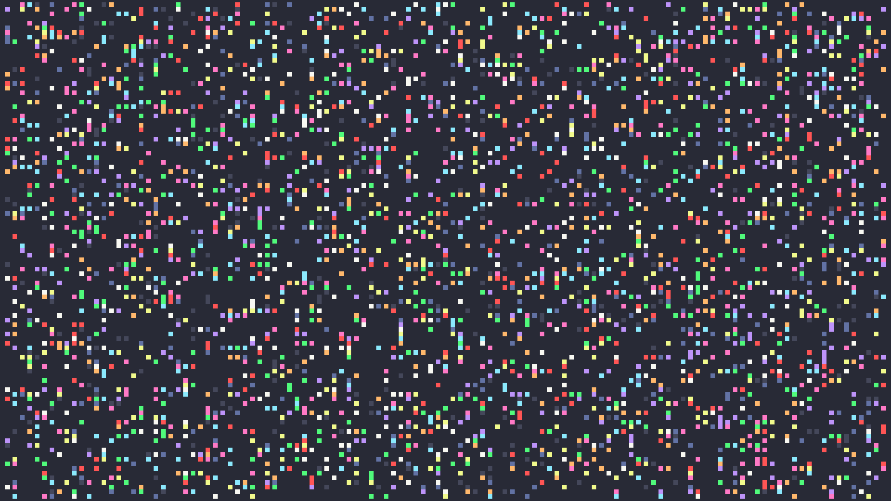
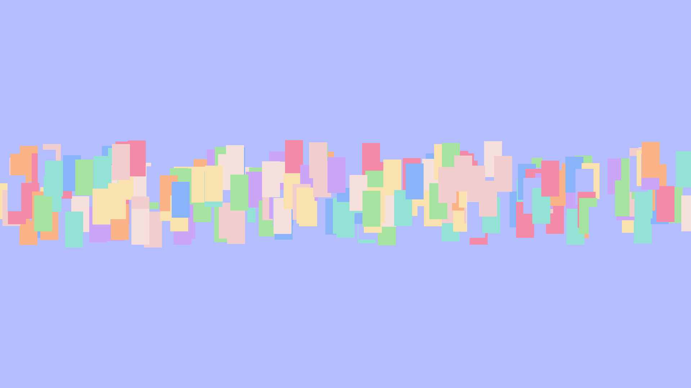
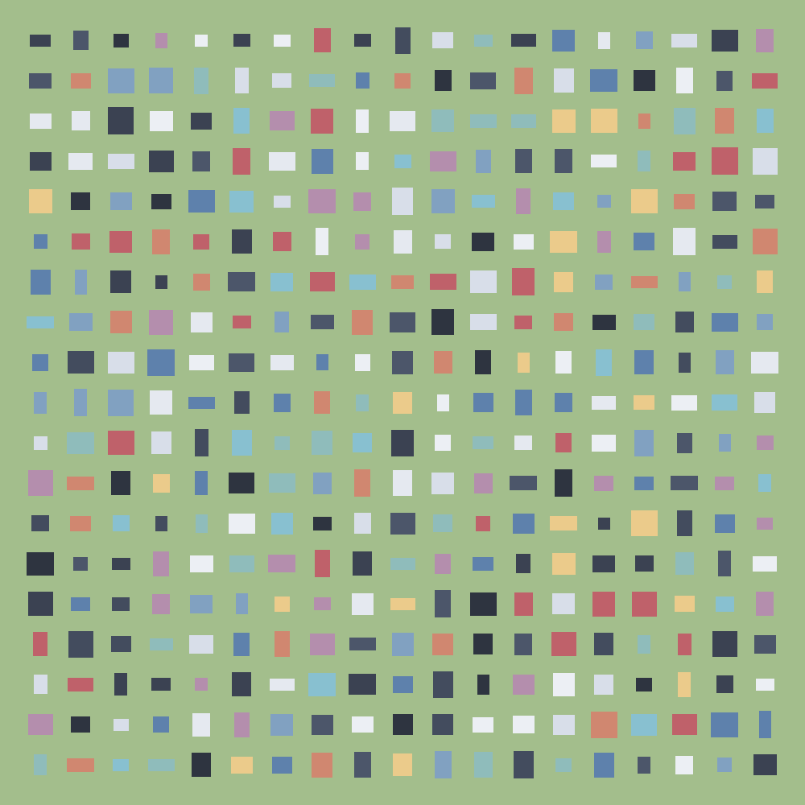
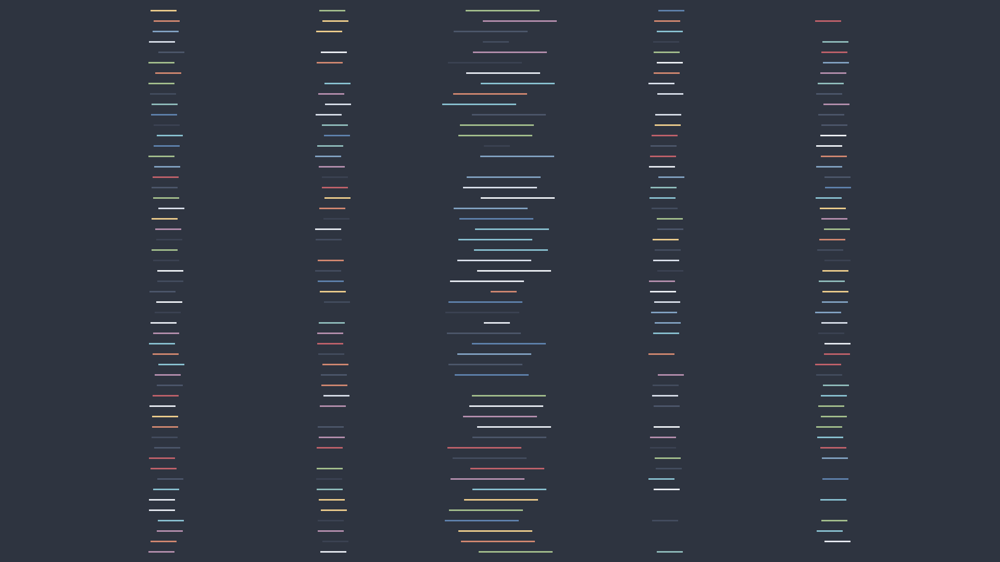

# rects 
> an elaborate rectangle drawer

## Install
1. `git clone https://github.com/petergs/rects`
2. `cd ./rects`
3. `go build `
4. Add `rects` to your `PATH`.

## Usage
```
Usage of rects:
  -c string
        Specify a path to a config file
  -e string
        Extract colors from another file containing color codes
  -h int
        Set a canvasHeight (overrides the config file definition) (default -1)
  -i string
        Use an image as the canvas (overrides canvasColor)
  -o string
        Filename to use for output - should be a png (default "image.png")
  -p    Print the config to stdout
  -w int
        Set a canvasWidth (overrides the config file definition) (default -1)
  -x int
        Set a yDistFactor (overrides the config file definition) (default -1)
  -y int
        Set an xDistFactor (overrides the config file definition) (default -1)
```


### Quick Start
You can use the `-e` switch to pull colors from existing config files (your terminal color scheme, .Xresources, etc). Combine that with `-w` and `-h` to set a canvasWidth and canvasHeight. Then, add `-x` and `-y` to set an x and y distribution - this is how many rectangles will be drawn along the given axis (minus 1).

For example:
```
rects -e ./examples/randomize/colors.yml -w 1920 -h 1080 -x 40 -y 20
```

That command will extract the hex RGB color codes from colors.yml and then draw 39x19 rectangles on a 1920x1080 canvas. The remaining configuration parameters will be randomized (poorly).

Add the `-p` flag to print the generated configs to stdout (or redirect to a file). Run this a few times until you get something that you like. 
```
rects -e ./examples/randomize/colors.yml -w 1920 -h 1080 -x 40 -y 20 -p > config.json
```

You can use that as a base, modify as desired, and then pass only the `-c` flag instead.
```
rects -c config.json
```

### Config File 
The general intention of the commandline arguments is to get some quick output, but you'll get some more interesting drawings using the JSON config file. There are some examples in the `./examples/` directory for reference.

| Parameter        | Type           | Required | Default | Description |
| ---------------- | -------------- | -------- | ------- | ----------- |
| rectColors       | (String) Array | Yes      | N/A     | A list of hex triplets (html color codes) preceeded by `#` that defines the possible colors for the rectangles. Alpha is not supported (alas, a triplet). |
| canvasWidth      | Number (int)   | Yes      | N/A     | An integer value defining the background size for the canvas along the X axis. The resulting png file will be this many pixels wide. |
| canvasHeight     | Number (int)   | Yes      | N/A     | An integer value defining the background size for the canvas along the Y axis. The resulting png file will be this many pixels tall. |
| canvasColor      | String         | Yes      | N/A     | A hex triplet preceeded by `#` defining the color of the background canvas. |
| xDistFactor      | Number (int)   | Yes      | N/A     | The number of rectangles (minus 1) that will be drawn along the X axis. The best values here are factors of `canvasWidth`. |
| yDistFactor      | Number (int)   | Yes      | N/A     | The number of rectangles (minus 1) that will be drawn along the Y axis. The best values here are factors of `canvasHeight`. |
| rectWidth        | Number (int)   | Yes      | N/A     | The width in pixels of each rectangle. |
| rectHeight       | Number (int)   | Yes      | N/A     | The height in pixels of each rectangle. |
| jitterX          | Number (int)   | No       | 0       | For each rectangle drawn, a random value between `-jitterX` and `jitterX` will be applied to offset the X position of the rectangle. |
| jitterY          | Number (int)   | No       | 0       | For each rectangle drawn, a random value between `-jitterY` and `jitterY` will be applied to offset the Y position of the rectangle. |
| jitterWidth      | Number (int)   | No       | 0       | For each rectangle drawn, a random value between `-jitterHeight` and `jitterHeight` will be applied to offset the width of the rectangle. |
| jitterHeight     | Number (int)   | No       | 0       | For each rectangle drawn, a random value between `-jitterHeight` and `jitterHeight` will be applied to offset the height of the rectangle. |
| weight           | Number (int)   | No       | 0       | An integer value that defines how many times `weightedColor` will get added to `rectColors`. This is effectively a shorthand form of manually adding the same color to `rectColors` to increase the chance that color is used. If `weightedColor` is defined in the config file, then `weight` is also required. |
| weightedColor    | String         | No       | N/A     | A hex triplet preceeded by `#` for the color that the `weight` property will apply to. If weight is defined in the config file, `weightedColor` is also required. |
| preserveSquare   | Boolean        | No       | False   | A boolean value that, when `True`, uses `jitterWidth` as the jitter value for both `rectWidth` and `rectHeight`. This is provided to allow jitter, but also ensure that you only draw squares if thats what you want. |

The drawing algorithm does the following (which might help illuminate the effect of the configuration parameters further):
1. Iterate over all pixels on the canvas.
2. For each pixel pair (`x`,`y`), check if there should be a rectangle at (`x`,`y`) based on `xDistFactor`, `yDistFactor` and the canvas dimensions (check `draw.go` for further specification).
3. If there should be a rectangle drawn at (`x`,`y`), select a random color from `rectColors` for the rectangle. Set jitter values for the rectangle to random values within the supplied bounds for `jitterX`, `jitterY`, `jitterWidth`, and `jitterHeight`.
4. Draw a rectangle of height `rectHeight`+`jitterHeight` and width `rectWidth`+`jitterWidth`. The center of the rectangle will be at `x`+`jitterX` and `y`+`jitterY`.

## Gallery




